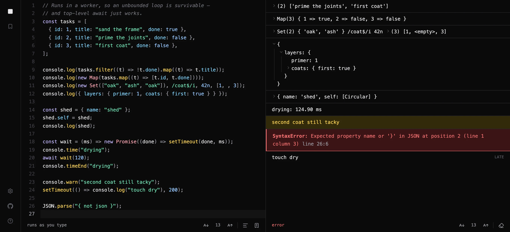
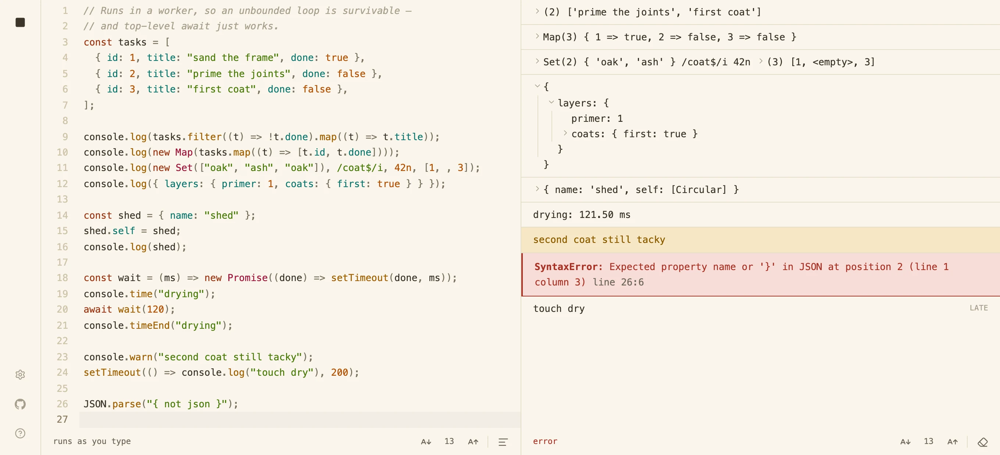
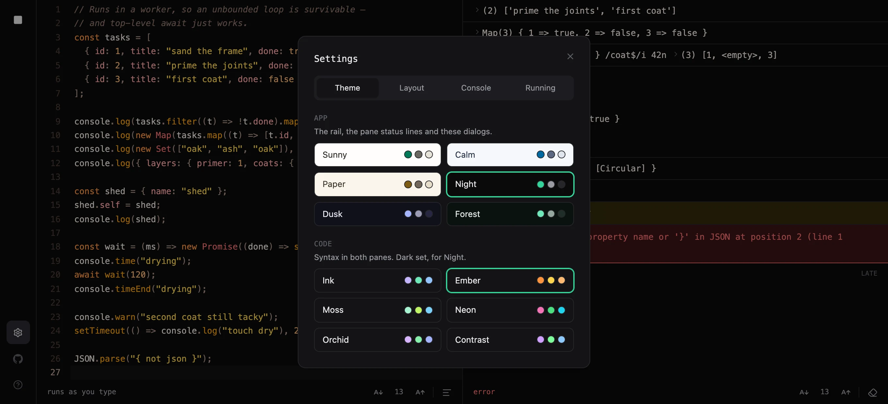

# JSPlayground

A JavaScript scratchpad in two panes: the source in one, whatever it printed in the other.
It runs your code as you type, in a Web Worker that can be killed — so `while (true) {}` is
something you try rather than something you recover from.

**[Open it →](https://jsplayground.rizki.id)** · no account, no build step, no network once
it has loaded — and installable, if you would rather it were a window than a tab.



## Why another one

Plenty of scratchpads send your code to a server, and plenty run it on the same thread as
the page. The first needs a network and a round trip; the second means one bad loop takes
the tab with it. This one runs everything locally, in a worker, which is what lets it do
two things at once: re-run on every keystroke, **and** survive code that never returns.
Running locally is also what makes it worth installing: there is no server to be cut off
from, so on a plane it is the same app it is at a desk.

## What it does

**Runs your code, safely**

- **A fresh worker per run.** Globals cannot leak from one run into the next, and the
  previous run — which may still be holding a core — is terminated before the next starts.
- **An unbounded loop is survivable.** A watchdog terminates the thread, because
  `terminate()` is the only thing that actually stops `while (true) {}`. The limit is yours
  to set, between 100 ms and 5 s.
- **Top-level `await` just works.** Code is run through `AsyncFunction`, and output that
  arrives after the top-level code finished is tagged `late` rather than silently dropped.
- **Runs as you type**, debounced — or freeze it and run with `⌘↵` when you are ready.
  An amber dot tells you the code has moved on since the result you are looking at.

**Shows you what you actually got**

- **Values print as themselves.** `Map`, `Set`, typed arrays, `BigInt`, symbols, regexps,
  dates, sparse arrays, `-0` — not `[object Object]`.
- **Objects open.** Anything with members to show gets a one-line summary and a disclosure
  triangle, with the members below and the closing brace under the key that opened it — the
  shape of the source you would have written.
- **Circular references, getters and revoked proxies are handled**, not crashed on: a cycle
  says `[Circular]`, and a getter is named rather than invoked.
- **Two switches in the output's own line** — whether values arrive open or shut, and
  whether the output is coloured at all. Both reach output already on screen, so you flip
  one while reading rather than before the run that needed it.
- **A huge value cannot take the tab with it.** Depth, width and a total budget per line
  keep `console.log` of a million-element array from becoming a 47 MB message and a
  multi-second freeze. Whatever is left out says `… N more`, the same way a merely wide
  value does.
- **Errors carry their line number**, mapped back to the editor's own numbering — including
  syntax errors, thrown non-`Error`s and unhandled rejections.
- **`console` is most of the real one**: `log` `info` `warn` `error` `debug` `assert`
  `count` `time`/`timeEnd`, each in its own colour where it has one. `table`, `dir`,
  `trace` and `group` are accepted, and print their arguments as a line. `alert`, `prompt` and
  `confirm` answer in the console rather than throwing, because a worker has none of them
  and a bare `ReferenceError` teaches nothing.

**Gets out of your way**

- **A layout that moves.** Panes in rows or columns, either one first, and a divider that
  drags with a mouse, a finger or a pen. Double-click resets it.
- **Twelve code themes and six app themes**, paired so that going dark and back again
  returns the theme you started on. Each pane's text size steps independently.
- **Format with Prettier**, fetched on the click rather than on load, so it costs nothing
  until you want it.
- **Completion scoped to the sandbox** — it offers what the worker actually has, not
  `document` and `localStorage`, which are not there.
- **`⌘D` selects the next occurrence** — the word under the cursor, then one more with
  each press, each with a cursor of its own, exactly where your hands expect it. It works
  from anywhere in the app, so the browser does not take the key and bookmark the page.
- **Everything is remembered** — the code you left in the editor, and theme, layout,
  split, run mode, text sizes and timeout with it — in `localStorage`, read before the
  first frame so there is no flash of the wrong theme and nothing to retype. The document
  is written once typing settles, and flushed if the tab is hidden or closed first, so
  shutting the window mid-sentence keeps the sentence. Blocked storage costs you the
  memory, not the app.
- **Installable, and offline for real.** A service worker caches the app — Prettier's
  chunks included, so Format works with the network off too — and the browser offers to
  install it. A new version is downloaded but never forced on an open tab: the editor's
  buffer lives in memory, and reloading under you would be reloading over your work.

| | |
|---|---|
|  |  |
| Light themes are first-class, not an afterthought | Twelve code palettes, paired to the app theme |

## Installing it, and using it offline

It is a PWA, so the browser will keep the whole app — Prettier included — the first time
you open it. After that visit it needs no network at all: open it on a plane and it is the
app it was at your desk.

To give it a window of its own:

- **Chrome, Edge, Brave (desktop)** — click the install icon at the right-hand end of the
  address bar, or ⋮ → *Cast, save and share* → *Install page as app*.
- **Safari (macOS)** — *File* → *Add to Dock*.
- **Safari (iOS/iPadOS)** — *Share* → *Add to Home Screen*.
- **Chrome (Android)** — ⋮ → *Add to Home screen* → *Install*.

Firefox on desktop has no install of its own; the offline half works there regardless.

Updates are downloaded in the background and never applied to a tab you are working in —
the editor's contents live in memory as well as in storage, and a reload you did not ask
for is a reload over your work. Close the app and open it again to pick up a new version.

## Running it

```bash
npm install
npm run dev      # http://localhost:5173
```

`npm run build` type-checks and builds; `npm run lint` runs ESLint. React 19, TypeScript,
Vite, CodeMirror 6 and Tailwind 4 — no state library, no test framework, no backend.

The service worker is built, not served by the dev server, so `npm run dev` has none of it:
offline and installing are things to try against `npm run preview`.

## How it is put together

The whole app is one self-contained folder,
[`src/components/jsplayground`](src/components/jsplayground) — `src/App.tsx` renders it and
does nothing else. Drop the folder into another React app and it works; its only imports
from outside itself are React, CodeMirror, `lucide-react` and Prettier, the last behind a
dynamic import.

Being installable is the one thing that is not in the folder, because it cannot be: a
service worker, a manifest and a set of icons belong to an origin rather than to a
component. They live in `vite.config.ts` (`vite-plugin-pwa`), `index.html` and `public/`,
and dropping the folder into another app carries the playground without them.

[**Its README**](src/components/jsplayground/README.md) is the design document: how the
sandbox is built and stringified into a blob worker, why the output is a tree rather than
wrapped text, how the two palettes stay in step, and what the boundaries actually are — the
worker guards against mistakes rather than against malice, and the README says so plainly.

## A note on the sandbox

A blob worker shares the page's origin. It has no DOM and it can be terminated mid-loop,
which is everything a playground needs, but it is not a security boundary: `fetch` from
inside it is a same-origin request. That costs nothing on a static site with no session and
nothing to ask for — it would be the first thing to think about if you dropped this into an
app that has either.

---

Happy coding.
